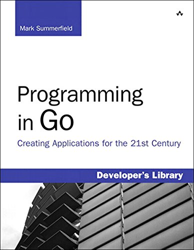
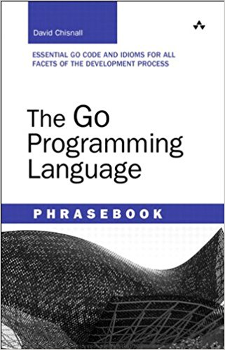

# gobyes

Collect a couple of gobyes (Go By Examples) repositories to learn, analyse and streamline. If you like to contribute, please star/fork also the original repos, buy the books, obtain a ticket to / organize a gopher conference or spread the words.

Here are the links to the original repos or homepages, please star/fork/bookmark:

<ol>
  <li><b>ae6rt.golang-examples</b>	https://github.com/ae6rt/golang-examples</li>
  <li><b>agtorre.go-cookbook</b>	https://github.com/agtorre/go-cookbook</li>
  <li><b>apress.go-recipes</b>	https://github.com/Apress/go-recipes</li>
  <li><b>chisnall.phrasebook</b> http://bit.ly/go-phrasebook (google-books)</li>
  <li><b>codegangsta.essential-go</b>	https://github.com/codegangsta/essential-go</li>
  <li><b>golang.example</b>	https://github.com/golang/example</li>
  <li><b>golang.tour</b>	https://github.com/golang/tour</li>
  <li><b>iand.gocookbook</b>	https://github.com/iand/gocookbook</li>
  <li><b>mkaz.working-with-go</b>	https://github.com/mkaz/working-with-go</li>
  <li><b>mmcgrana.gobyexample</b>	https://github.com/mmcgrana/gobyexample</li>
  <li><b>SimonWaldherr.golang-examples</b>	https://github.com/SimonWaldherr/golang-examples</li>
</ol>

  
   
   
   

### 1. ae6rt.golang-examples
This are the repo of the book "Programming in Go" by Mark Summerfield. 101 Go-Files in 66 Folder and 8 Chapters.  
Amazon-Kindle: http://bit.ly/go-prg-in-go (2012)  
<!-- Playable via readme.md folder inside: [ae6rt.golang-examples](ae6rt.golang-examples/goeg/src)-->  

   

### 2. agtorre.go-cookbook
13 chapters full of examples and recipes. Find the book (paperback, ebook, online) for this gobyes here:  
http://bit.ly/go-agtorre-cookbook (2017)  
   

### 3. apress.go-recipes
In 8 chapters and 83 go files your find a wide range a really usefull examples.
http://bit.ly/go-recipes (2016)  
   

### 4. chisnall.phrasebook
Excellent sourcecodes from "The Go Programming Language Phrasebook" by David Chisnall (2012).  
  
   

### 5. codegangsta.essential-go
A smart collection of 14 important go examples from around 2015.  
   

### 6. golang.example
This is official example collection with around 18 bit more complex examples.  
   

### 7. golang.tour
This is the repo of the of the "A Tour of Go". One of the first thing you have to check if you want to master go. It's an awesome interactive online tour which explains a lot of go aspects, starting with a "Hello World" and not ending with this pointer stuff.  
https://tour.golang.org/welcome/1  
   

### 8. iand.gocookbook
Around 45 go recipes tenderly wrapped into markdown.  
   

### 9. mkaz.working-with-go
Over 20 well documented code examples, with an extra section for the euler.  
   

### 10. mmcgrana.gobyexample
The mother of all gobyes. 65 pieces perfectly edited and made with a lot of passion for the details.  
https://gobyexample.com/  
   

### 11. SimonWaldherr.golang-examples
Simons gobye repository is one of the most comprehensive one. It is divided into three sections: beginner (38), advanced (54) & expert (22).  
   
