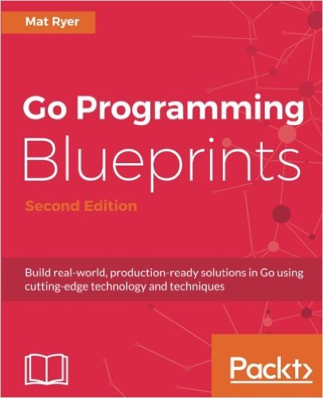

# Go By Examples - Corpus

  

### gobyes
  
  

We collect a couple of gobyes (Go By Examples) repositories to learn, analyse and streamline. If you like to contribute, please star/fork at first the original repos, buy the books, book the courses, obtain a ticket to / organize a gopher conference and/or spread the words.

Find the origin github repos behind  or click on "last commit" in the details. Please star/fork/bookmark them alot.
   

<table>
    <tr>
        <td valign="top">
            <ol start="1">
                <li><a href="#adonovangopl-2015"><b>adonovan.gopl</b></a> </li> 
                <li><a href="#agtorrego-cookbook-2017"><b>agtorre.go-cookbook</b> </li>
                <li><a href="#apressgo-recipes-2016"><b>apress.go-recipes</b></a> </li>
                <li><a href="#arschlesgo-in-5-minutes"><b>arschles.go-in-5-minutes</b></a> </li>
                <li><a href="#astaxiebuild-web-with-go"><b>astaxie.build-web</b></a></li>
                <li><a href="#chisnallphrasebook-2012"><b>chisnall.phrasebook</b> </li>
                <li><a href="#codegangstabwag"><b>codegangsta.bwag</b> </li>
                <li><a href="#codegangstaessential-go"><b>codegangsta.essential</b></a> </li>
                <li><a href="#goes211golangtraining"><b>goes211.golangtraining</b></a> </li>
                <li><a href="#goes211golang-web-dev"><b>goes211.golang-web-dev</b></a> </li>
                <li><a href="#goinactioncode-2015"><b>goinaction.code (2015)</b> </li>
                <li><a href="#golangexample"><b>golang.example</b></a> </li>
                <li><a href="#golangtour"><b>golang.tour</b></a> </li>
                <li><a href="#golangsamanytype"><b>golangsam.anytype</b> </li>
                <li><a href="#jochasingagolang-book"><b>jochasinga.golang-book</b> </li>
            </ol>
        </td>
        <td valign="top">
            <ol start="16">
                <li><a href="#katconcurrency-go"><b>kat.concurrency-go</b></a> </li>
                <li><a href="#mstrmndsgo-in-practice-2016"><b>mstrmnds.go-in-practice</b> </li>   
                <li><a href="#matryergoblueprints"><b>matryer.goblueprints</b> </li>
                <li><a href="#mkazworking-with-go"><b>mkaz.working-with-go</b></a> </li>
                <li><a href="#mmcgranagobyexample"><b>mmcgrana.gobyexample</b></a> </li>
                <li><a href="#mshindletidbits"><b>mshindle.tidbits</b></a> </li>
                <li><a href="#nathanyget-programming-with-go-upcoming"><b>nathany.get-programming</b> </li>
                <li><a href="#pktbuild-restful-2017"><b>pkt.build-restful (2017)</b></a>  </li>
                <li><a href="#pktcloudnative-2017"><b>pkt.cloudnative (2017)</b></a>  </li>
                <li><a href="#pktgo-designpatterns-2017"><b>pkt.go-designpatterns (2017)</b></a>  </li>
                <li><a href="#pktsystemsprogramming-2017"><b>pkt.systemsprogramming (2017)</b></a>  </li>
                <li><a href="#pktgo-buildwebapp-2016"><b>pkt.go-buildwebapp (2016)</b></a>  </li>
                <li><a href="#pktgo-buildsevenapps-2017"><b>pkt.go-buildsevenapps (2017)</b></a>  </li>
                <li><a href="#pktgo-patternforrealworld-2017"><b>pkt.go-pattern4real (2017)</b></a>  </li>
                <li><a href="#pktisomorphic-go-2017"><b>pkt.isomorphic-go (2017)</b></a>  </li>
            </ol>
        </td>
        <td valign="top">
            <ol start="31">
                <li><a href="#pktlearning-functional-go-2017"><b>pkt.learning-functional-go (2017)</b></a>  </li>
                <li><a href="#pktlearning-go-2016"><b>pkt.learning-go (2016)</b></a>  </li>
                <li><a href="#pktmachinelearning-go-2017"><b>pkt.machinelearning-go (2017)</b></a>  </li>
                <li><a href="#pktsecurity-go-2018"><b>pkt.security-go (2018)</b></a>  </li>
                <li><a href="#shapeshedgo-in-24-2017"><b>shapeshed.go-in-24</b> </li>  
                <li><a href="#simonwaldherrgolang-examples"><b>SimonWaldherr.golang-examples</b> </li>
                <li><a href="#thewhitetulipweb-dev-golang-anti-textbook"><b>thewhitetulip.anti-textbook</b> </li>
                <li><a href="#xusiweilearn-golang"><b>xusiwei.learn-golang</b> </li>
            </ol>
        </td>
    </tr>
</table>

   
  
   

### adonovan.gopl (2015)

  
[⏮️](#gobyes)[⏪](#gobyes)[⏩](#agtorrego-cookbook-2017)[⏭️](#eop)  
Find here the sources of one of the best ranking Go-Book "The Go Programming Language" by Alan A.A. Donovan & Brian W. Kerninghan.  
[TOC](http://www.gopl.io/ch1.pdf)  
[HP](http://www.gopl.io/)  
  
   
   

### agtorre.go-cookbook (2017)

  
[⏮️](#gobyes)[⏪](#adonovangopl-2015)[⏩](#apressgo-recipes-2016)[⏭️](#eop)  
13 chapters full of examples and recipes by Aaron Torres.  
[TOC](https://www.packtpub.com/mapt/book/application_development/9781783286836)  
[HP](http://bit.ly/go-agtorre-cookbook)  
  
   
   

### apress.go-recipes (2016)

  
[⏮️](#gobyes)[⏪](#agtorrego-cookbook-2017)[⏩](#arschlesgo-in-5-minutes)[⏭️](#eop)  
In 8 chapters and 83 go files your find a wide range of really usefull examples.  
[TOC](https://books.google.de/books?id=mi6IDQAAQBAJ&printsec=frontcover&hl=de&source=gbs_ge_summary_r&cad=0#v=onepage&q&f=false)  
[HP](http://bit.ly/go-recipes)  
  
   
   

### arschles.go-in-5-minutes  
  
  
[⏮️](#gobyes)[⏪](#apressgo-recipes-2016)[⏩](#astaxiebuild-web-with-go)[⏭️](#eop)  
Find short in all code examples 5 Minutes Screencasts, linked via badge, which gives you a fast inside on specific topics. Great source for digging deeper into go.  
[TOC](https://www.goin5minutes.com/screencasts/)  
[HP](https://www.goin5minutes.com/)  
  
   
   

### astaxie.build-web-with-go  

  
[⏮️](#gobyes)[⏪](#arschlesgo-in-5-minutes)[⏩](#chisnallphrasebook-2012)[⏭️](#eop)  
Great multilingual international project with a good community. Backuped by the https://beego.me/ guys. If you have time it's worth to check the GoCodeReport and add some enhancing pull requests.  
[TOC](toc)  
HP in: [en](https://astaxie.gitbooks.io/build-web-application-with-golang/content/en/) | 
[de](https://astaxie.gitbooks.io/build-web-application-with-golang/content/de/) | 
[fr](https://astaxie.gitbooks.io/build-web-application-with-golang/content/fr/) | 
[pt](https://astaxie.gitbooks.io/build-web-application-with-golang/content/pt-br/) | 
[ja](https://astaxie.gitbooks.io/build-web-application-with-golang/content/ja/) | 
[zh](https://astaxie.gitbooks.io/build-web-application-with-golang/content/zh/)  
  
   
   

### chisnall.phrasebook (2012)

  
[⏮️](#gobyes)[⏪](#astaxiebuild-web-with-go)[⏩](#codegangstabwag)[⏭️](#eop)  
Here are the sourcecodes from "The Go Programming Language Phrasebook" by David Chisnall. This is a zip-download and git upstream-mirror.  
[TOC](http://bit.ly/go-phrasebook)  
[HP](http://www.informit.com/store/go-programming-language-phrasebook-9780321817143)  
  
   
   

### codegangsta.bwag

  
[⏮️](#gobyes)[⏪](#chisnallphrasebook-2012)[⏩](#codegangstaessential-go)[⏭️](#eop)  
Codegangst dig here into the world of "building-web-applications-with-go" Beside go itself you can learn here also a lot about heroku & microservices.  
[TOC](toc)  
[HP](https://codegangsta.gitbooks.io/building-web-apps-with-go/)  
  
   
   

### codegangsta.essential-go

  
[⏮️](#gobyes)[⏪](#codegangstabwag)[⏩](#goes211golangtraining)[⏭️](#eop)  
A smart collection of 14 important go examples from around 2015. He also offers this in a video course.  
[Code gobye](corpus/codegangsta/essential-go)  
[TOC](toc)  
[HP](https://www.kajabinext.com/marketplace/courses/1-essential-go)  
  
   
   

### goes211.golangtraining  

  
[⏮️](#gobyes)[⏪](#codegangstaessential-go)[⏩](#goes211golang-web-dev)[⏭️](#eop)  
Learn programming from a University Professor in Computer Science with over 20 years of teaching experience.  
[TOC](toc)  
[HP](https://www.greatercommons.com/learn/5098183625539584)  
  
   
   

### goes211.golang-web-dev  

  
[⏮️](#gobyes)[⏪](#goes211golangtraining)[⏩](#goinactioncode-2015)[⏭️](#eop)  
Learn web programming with go from a University Professor in Computer Science with over 20 years of teaching experience.  
[TOC](toc)  
[HP](https://www.greatercommons.com/learn/6600110066630656)  
  
  
   

### goinaction.code (2015)

  
[⏮️](#gobyes)[⏪](#goes211golang-web-dev)[⏩](#golangexample)[⏭️](#eop)  
Great Manning Book written by William Kennedy with Brian Ketelson and Erik St. Martin.  
[TOC](toc)  
[HP](https://www.manning.com/books/go-in-action)  
  
   
   

### golang.example

  
[⏮️](#gobyes)[⏪](#goinactioncode-2015)[⏩](#golangtour)[⏭️](#eop)  
This is the official example collection with around 18 bit more complex examples.  
[TOC](toc)  
[HP](https://github.com/golang/example/blob/master/README.md)  
  
   
   

### golang.tour

  
[⏮️](#gobyes)[⏪](#golangexample)[⏩](#golangsamanytype)[⏭️](#eop)  
This is the repo of the "A Tour of Go". One of the first thing you have to play with if you want to try go. It's an awesome interactive online tour which explains a lot of go aspects, starting with a "Hello World" and not ending with this damn c-like pointer stuff.  
[TOC](toc)  
[HP](https://tour.golang.org/welcome/1)  
  
   
   

### golangsam.anytype

  
[⏮️](#gobyes)[⏪](#golangtour)[⏩](#jochasingagolang-book)[⏭️](#eop)  
Templates, and ready-to-use go lang source files - generated with dotgo. Here is important not to read the generated stuff, but to understand the mechanic of generation.  
[TOC](toc)  
[HP](https://golangsam.github.io/)  
  
   
   

### jochasinga.golang-book

  
[⏮️](#gobyes)[⏪](#golangsamanytype)[⏩](#katconcurrency-go)[⏭️](#eop)  
The Book was written by Caleb Doxsey with all the go files "inline". Find here an extract of this file into a github repo. Perhaps we find a solution to get this stuff more in sync to bit more actual original.  
[TOC](toc)  
[HP](http://www.golang-book.com/)  
  
   
   

### kat.concurrency-go

  
[⏮️](#gobyes)[⏪](#jochasingagolang-book)[⏩](#mstrmndsgo-in-practice-2016)[⏭️](#eop)  
Concurrency is one of the core use cases of golang, so if you want master this find a got starting point with this book.  
[TOC](toc)  
[HP](http://katherine.cox-buday.com/concurrency-in-go/)  
  
    
   

### mstrmnds.go-in-practice (2016)

  
[⏮️](#gobyes)[⏪](#katconcurrency-go)[⏩](#matryergoblueprints)[⏭️](#eop)  
Find here the sourcecodes from the book "Go in Practive" in 11 Chapters, 129 Go-Files and 70 Techniques.    
[TOC](toc)  
[HP](https://www.manning.com/books/go-in-practice )  
  
   
   

### matryer.goblueprints

  
[⏮️](#gobyes)[⏪](#mstrmndsgo-in-practice-2016)[⏩](#mkazworking-with-go)[⏭️](#eop)  
Expect nearly 90 go files organised in 11 chapters in this awesome lecture about go by mastermind Mat Ryer, who is also one guy behind http://gopherize.me.  
[TOC](toc)  
[HP](https://www.packtpub.com/application-development/go-programming-blueprints-second-edition)  
  
   
   

### mkaz.working-with-go

  
[⏮️](#gobyes)[⏪](#matryergoblueprints)[⏩](#mmcgranagobyexample)[⏭️](#eop)  
Over 20 well documented code examples, with an extra section for the euler mathematix fans.  
[TOC](toc)  
[HP](tbd)  
  
   
   

### mmcgrana.gobyexample

  
[⏮️](#gobyes)[⏪](#mkazworking-with-go)[⏩](#mshindletidbits)[⏭️](#eop)  
The Mother of all GoBye's with over 60 go examples.  
[TOC](toc)  
[HP](https://gobyexample.com/)  
  
   
   

### mshindle.tidbits

  
[⏮️](#gobyes)[⏪](#mmcgranagobyexample)[⏩](#nathanyget-programming-with-go-upcoming)[⏭️](#eop)  
Around 14 snippets of example golang code to help teach certain concepts.     
[TOC](toc)  
  
   
   

### nathany.get-programming-with-go (upcoming)

  
[⏮️](#gobyes)[⏪](#mshindletidbits)[⏩](#pktbuild-restful-2017)[⏭️](#eop)  
Find here the sourcecodes of this upcoming book in 2018 "Get Programming in Go" in MEAP-State.  
[TOC](toc)  
[HP](https://www.manning.com/books/get-programming-with-go)  
  
   
   

### pkt.build-restful (2017)

  
[⏮️](#gobyes)[⏪](#nathanyget-programming-with-go-upcoming)[⏩](#pktcloudnative-2017)[⏭️](#eop)  
Title: Building RESTful Web services with Go  
Authors(s): Naren Yellavula  
Abstract: Smart Description here ...  
[TOC](toc)  
[HP](https://www.packtpub.com/application-development/building-restful-web-services-go?utm_source=github&utm_medium=repository&utm_campaign=9781788294287)  
  
  
 

### pkt.cloudnative (2017)

  
[⏮️](#gobyes)[⏪](#pktbuild-restful-2017)[⏩](#pktgo-designpatterns-2017)[⏭️](#eop)  
Title: Cloud Native programming with Golang  
Authors(s): Mina Andrawos, Martin Helmich  
Abstract: Smart Description here ...  
[TOC](toc)  
[HP](https://www.packtpub.com/application-development/cloud-native-programming-golang)  
  
  
 

### pkt.go-designpatterns (2017)

  
[⏮️](#gobyes)[⏪](#pktcloudnative-2017)[⏩](#pktsystemsprogramming-2017)[⏭️](#eop)  
Title: Go Design Patterns  
Authors(s): Mario Castro Contreras  
Abstract: Smart Description here ...  
[TOC](toc)  
[HP](https://www.packtpub.com/application-development/go-design-patterns)  
  
  
 

### pkt.systemsprogramming (2017)

  
[⏮️](#gobyes)[⏪](#pktgo-designpatterns-2017)[⏩](#pktgo-buildwebapp-2016)[⏭️](#eop)  
Title: Go Systems Programming  
Authors(s): Mihalis Tsoukalos  
Abstract: Smart Description here ...  
[TOC](toc)  
[HP](https://www.packtpub.com/mapt/book/networking_and_servers/9781787125643)  
  
  
 

### pkt.go-buildwebapp (2016)

  
[⏮️](#gobyes)[⏪](#pktsystemsprogramming-2017)[⏩](#pktgo-buildsevenapps-2017)[⏭️](#eop)  
Title: Go: Building Web Applications  
Authors(s): Nathan Kozyra, Mat Ryer  
Abstract: Smart Description here ...  
[TOC](toc)  
[HP](https://www.packtpub.com/application-development/go-building-web-applications)  
  
  
 

### pkt.go-buildsevenapps (2017)

  
[⏮️](#gobyes)[⏪](#pktgo-buildwebapp-2016)[⏩](#pktgo-patternforrealworld-2017)[⏭️](#eop)  
Title: Go: Building 7 Real-World Projects  
Authors(s): Ben Trantor, Rostislav Zsinko, Mat Ryer  
Abstract: Smart Description here ...  
[TOC](toc)  
[HP](https://www.packtpub.com/application-development/go-building-7-real-world-projects)  
  
  
 

### pkt.go-patternforrealworld (2017)

  
[⏮️](#gobyes)[⏪](#pktgo-buildsevenapps-2017)[⏩](#pktisomorphic-go-2017)[⏭️](#eop)  
Title: Go: Design Patterns for Real-World Projects  
Authors(s): Vladimir Vivien, Mario Castro Contreras, Mat Ryer  
Abstract: Smart Description here ...  
[TOC](toc)  
[HP](https://www.packtpub.com/application-development/go-design-patterns-real-world-projects)  
  
  
 

### pkt.isomorphic-go (2017)

  
[⏮️](#gobyes)[⏪](#pktgo-patternforrealworld-2017)[⏩](#pktlearning-functional-go-2017)[⏭️](#eop)  
Title: Isomorphic Go  
Authors(s): Kamesh Balasubramanian  
Abstract: Smart Description here ...  
[TOC](toc)  
[HP](https://www.packtpub.com/web-development/isomorphic-go)  
  
  
 

### pkt.learning-functional-go (2017)

  
[⏮️](#gobyes)[⏪](#pktisomorphic-go-2017)[⏩](#pktlearning-go-2016)[⏭️](#eop)  
Title: Learning Functional Programming in Go  
Authors(s): Lex Sheehan  
Abstract: Smart Description here ...  
[TOC](toc)  
[HP](https://www.packtpub.com/application-development/learning-functional-programming-go)  
  
  
 

### pkt.learning-go (2016)

  
[⏮️](#gobyes)[⏪](#pktlearning-functional-go-2017)[⏩](#pktmachinelearning-go-2017)[⏭️](#eop)  
Title: Learning Go Programming  
Authors(s): Vladimir Vivien  
Abstract: Smart Description here ...  
[TOC](toc)  
[HP](https://www.packtpub.com/application-development/learning-go-programming?utm_source=github&utm_medium=repository&utm_campaign=9781784395438)  
  
  
 

### pkt.machinelearning-go (2017)

  
[⏮️](#gobyes)[⏪](#pktlearning-go-2016)[⏩](#pktsecurity-go-2018)[⏭️](#eop)  
Title: Machine Learning With Go  
Authors(s): Daniel Whitenack  
Abstract: Smart Description here ...  
[TOC](toc)  
[HP](https://www.packtpub.com/big-data-and-business-intelligence/machine-learning-go)  
  
  
 

### pkt.security-go (2018)

  
[⏮️](#gobyes)[⏪](#pktmachinelearning-go-2017)[⏩](#shapeshedgo-in-24-2017)[⏭️](#eop)  
Title: Security with Go  
Authors(s): John Daniel Leon  
Abstract: Smart Description here ...  
[TOC](toc)  
[HP](https://www.packtpub.com/networking-and-servers/security-go)  
  
  
 

### shapeshed.go-in-24 (2017)

  
[⏮️](#gobyes)[⏪](#pktsecurity-go-2018)[⏩](#simonwaldherrgolang-examples)[⏭️](#eop)  
Here you find the sourcecode of one of the best structured book: "Go in 24 hours". If you are in hurry, this one is for you.  
[TOC](toc)  
[HP](http://www.informit.com/store/go-in-24-hours-sams-teach-yourself-next-generation-9780134771977)  
  
   
   
  
### simonwaldherr.golang-examples

  
[⏮️](#gobyes)[⏪](#shapeshedgo-in-24-2017)[⏩](#thewhitetulipweb-dev-golang-anti-textbook)[⏭️](#eop)  
Simons gobye repository is one of the most comprehensive one. It is divided into three sections: beginner (38), advanced (54) & expert (22).  
[TOC](toc)  
[HP](corpus/simonWaldherr.golang-examples/readme.md)  
  
   
   

### thewhitetulip.web-dev-golang-anti-textbook

  
[⏮️](#gobyes)[⏪](#simonwaldherrgolang-examples)[⏩](#xusiweilearn-golang)[⏭️](#eop)  
Find within this project Video-Screencasts, gitbook or a leanpub download.  
[TOC](toc)  
[HP](https://thewhitetulip.gitbooks.io/webapp-with-golang-anti-textbook/content/)  
  
   
   

### xusiwei.learn-golang

  
[⏮️](#gobyes)[⏪](#thewhitetulipweb-dev-golang-anti-textbook)[⏩](#eop)[⏭️](#eop)  
This gobye is a golab out of 66 straight forward go examples which was created while xusiwei becomes a gopher ʕ◔ϖ◔ʔ.  
[TOC](toc)    
  
               

### eop  
.

