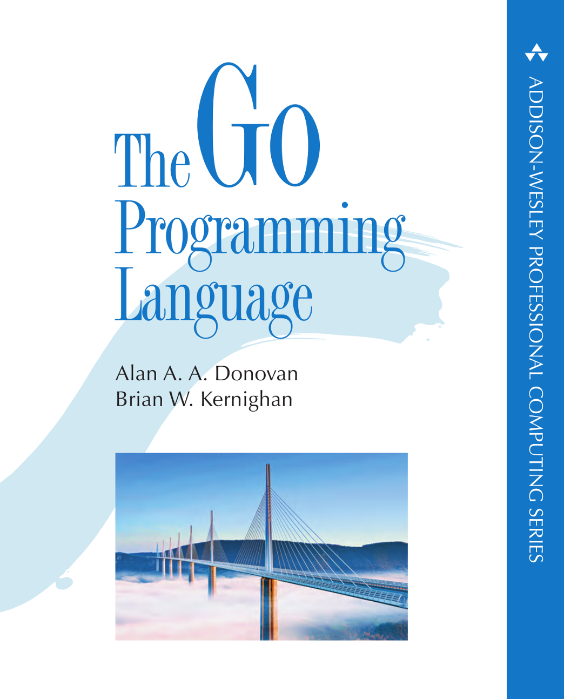

# gobyes

 (Overall)  

Collect a couple of gobyes (Go By Examples) repositories to learn, analyse and streamline. If you like to contribute, please star/fork also the original repos, buy the books, obtain a ticket to / organize a gopher conference or spread the words.

Here are the links to the details (⏩) and the original repos or homepages, please star/fork/bookmark:
   

<ol>
  <li><a href="#adonovangopl">⏩</a><b>adonovan.gopl</b>	https://github.com/adonovan/gopl.io/ 💫</li>  
  <li><a href="#agtorrego-cookbook">⏩</a><b>agtorre.go-cookbook</b>	https://github.com/agtorre/go-cookbook</li>
  <li><a href="#apressgo-recipes">⏩</a><b>apress.go-recipes</b>	https://github.com/Apress/go-recipes</li>
  <li><a href="#chisnallphrasebook">⏩</a><b>chisnall.phrasebook</b> https://github.com/CodeFreezr/phrasebook (mirror)</li>
  <li><a href="#codegangstaessential-go">⏩</a><b>codegangsta.essential-go</b>	https://github.com/codegangsta/essential-go</li>
  <li><a href="#golangexample">⏩</a><b>golang.example</b>	https://github.com/golang/example</li>
  <li><a href="#golangtour">⏩</a><b>golang.tour</b>	https://github.com/golang/tour</li>
  <li><a href="#iandgocookbook">⏩</a><b>iand.gocookbook</b>	https://github.com/iand/gocookbook</li>
  <li><a href="#mastermindsgo-in-practice">⏩</a><b>masterminds.go-in-practice</b> https://github.com/Masterminds/go-in-practice 💫</li>  
  <li><a href="#mkazworking-with-go">⏩</a><b>mkaz.working-with-go</b>	https://github.com/mkaz/working-with-go</li>
  <li><a href="#mmcgranagobyexample">⏩</a><b>mmcgrana.gobyexample</b>	https://github.com/mmcgrana/gobyexample</li>
  <li><a href="#nathanyget-programming-with-go">⏩</a><b>nathany.get-programming-with-go</b>  https://github.com/nathany/get-programming-with-go 💫</li>
  <li><a href="#shapeshedgo-in-24">⏩</a><b>shapeshed.go-in-24</b> https://github.com/shapeshed/golang-book-examples 💫</li>  
  <li><a href="#SimonWaldherrgolang-examples">⏩</a><b>SimonWaldherr.golang-examples</b>	https://github.com/SimonWaldherr/golang-examples</li>
</ol>

   
   
  
### adonovan.gopl
  
<a href="corpus/adonovan.gopl">▶️</a> Find here the sources of one of the best ranking Go-Book "The Go Programming Language" by Alan A.A. Donovan & Brian W. Kerninghan.  
http://www.gopl.io/ (2015)  

   
   
<a href="#gobyes">⏫</a>  

### agtorre.go-cookbook
  
<a href="corpus/agtorre.go-cookbook">▶️</a> 13 chapters full of examples and recipes. Find the book (paperback, ebook, online) for this gobyes here:  
http://bit.ly/go-agtorre-cookbook (2017)  

   
   
<a href="#gobyes">⏫</a>  

### apress.go-recipes
  
<a href="corpus/apress.go-recipes">▶️</a> In 8 chapters and 83 go files your find a wide range a really usefull examples.  
http://bit.ly/go-recipes (2016)  

   
   
<a href="#gobyes">⏫</a>  

### chisnall.phrasebook
  
<a href="corpus/chisnall.phrasebook/examples/">▶️</a> Here are the sourcecodes from "The Go Programming Language Phrasebook" by David Chisnall .  
http://bit.ly/go-phrasebook (2012)  
  
   
   
<a href="#gobyes">⏫</a>  

### codegangsta.essential-go
  
<a href="corpus/codegangsta.essential-go">▶️</a> A smart collection of 14 important go examples from around 2015.  
   
   
<a href="#gobyes">⏫</a>  

### golang.example
  
<a href="corpus/golang.example">▶️</a> This is the official example collection with around 18 bit more complex examples.  
   
   
<a href="#gobyes">⏫</a>  

### golang.tour
  
<a href="corpus/golang.tour">▶️</a> This is the repo of the of the "A Tour of Go". One of the first thing you have to check if you want to master go. It's an awesome interactive online tour which explains a lot of go aspects, starting with a "Hello World" and not ending with this pointer stuff.  
https://tour.golang.org/welcome/1  
   
   
<a href="#gobyes">⏫</a>   

### iand.gocookbook
  
<a href="corpus/adonovan.gopl">▶️</a> Around 45 go recipes tenderly wrapped into markdown. 🤔: Go Report won't analyse embedded code.   
   
   
<a href="#gobyes">⏫</a>  

### masterminds.go-in-practice
  
<a href="corpus/adonovan.gopl">▶️</a>  tbd.  
   
   
<a href="#gobyes">⏫</a>  

### mkaz.working-with-go
  
Over 20 well documented code examples, with an extra section for the euler.  
   
   
<a href="#gobyes">⏫</a>  

### mmcgrana.gobyexample
  
65 go examples.
https://gobyexample.com/  
   
   
<a href="#gobyes">⏫</a>  
  
### nathany.get-programming-with-go
  
tbd.  
   
   
<a href="#gobyes">⏫</a>  
  
### shapeshed.go-in-24
  
tbd.   
   
   
<a href="#gobyes">⏫</a>  
  
### SimonWaldherr.golang-examples
  
Simons gobye repository is one of the most comprehensive one. It is divided into three sections: beginner (38), advanced (54) & expert (22).  
   
   

   
   
   
   
   
   
   
   
   
   
   
   
   
   
   
   
   
   
   
   
   
   
   
   

   
   
   
   
   
   
   
   
   

### End-of-Page  
