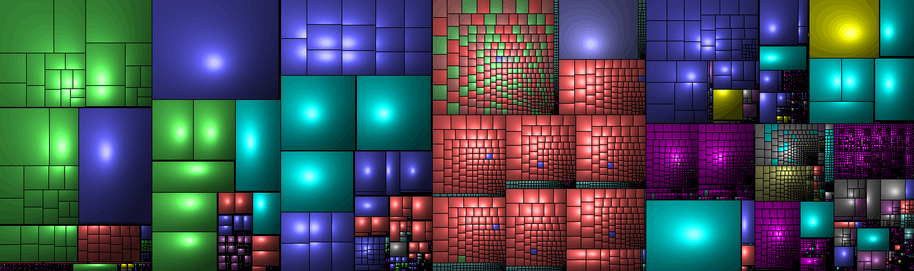

# gobyes

  
  

We collect a couple of gobyes (Go By Examples) repositories to learn, analyse and streamline. If you like to contribute, please star/fork at first the original repos, buy the books, book the courses, obtain a ticket to / organize a gopher conference and/or spread the words.

Here are the links to the origin github repos  and further details below ⏩. Please star/fork/bookmark them alot:
   

<ol>
  <li><a href="#adonovangopl-2015">⏩</a> <b>adonovan.gopl</b>	</li> 
  <li><a href="#agtorrego-cookbook-2017">⏩</a> <b>agtorre.go-cookbook</b> </li>
  <li><a href="#apressgo-recipes-2016">⏩</a> <b>apress.go-recipes</b>	</li>
  <li><a href="#arschlesgo-in-5-minutes">⏩</a> <b>arschles.go-in-5-minutes</b>	 new!</li>
  <li><a href="#astaxiebuild-web-with-go">⏩</a> <b>astaxie.build-web-with-go</b>	 new!</li>
  <li><a href="#chisnallphrasebook-2012">⏩</a> <b>chisnall.phrasebook</b>  (mirror)</li>
  <li><a href="#codegangstaessential-go">⏩</a> <b>codegangsta.essential-go</b>	</li>
  <li><a href="#goes211golangtraining">⏩</a> <b>goes211.golangtraining</b>	 new!</li>

<li><a href="#goes211golang-web-dev">⏩</a> <b>goes211.golang-web-dev</b>	 new!</li>
  <li><a href="#golangexample">⏩</a> <b>golang.example</b>	</li>
  <li><a href="#golangtour">⏩</a> <b>golang.tour</b>	</li>
  <li><a href="#katconcurrency-go">⏩</a> <b>kat.concurrency-go</b>	 (new)</li>
  <li><a href="#mastermindsgo-in-practice-2016">⏩</a> <b>masterminds.go-in-practice</b> </li>   
  <li><a href="#mkazworking-with-go">⏩</a> <b>mkaz.working-with-go</b>	</li>
  <li><a href="#mmcgranagobyexample">⏩</a> <b>mmcgrana.gobyexample</b>	</li>
  <li><a href="#mshindletidbits">⏩</a> <b>mshindle.tidbits</b>	 (new)</li>
  <li><a href="#nathanyget-programming-with-go-upcomming">⏩</a> <b>nathany.get-programming-with-go</b> </li>
  <li><a href="#shapeshedgo-in-24-2017">⏩</a> <b>shapeshed.go-in-24</b> </li>  
  <li><a href="#simo">⏩</a> <b>SimonWaldherr.golang-examples</b> </li>
  <li><a href="#xusiweilearn-golang">⏩</a> <b>xusiwei.learn-golang</b>  (new)</li>
</ol>
   
  
  
   
   

### adonovan.gopl (2015)

  
[⏮️](#gobyes)[⏪](#gobyes)[⏩](#agtorrego-cookbook-2017)[⏭️](#eop)  
Find here the sources of one of the best ranking Go-Book "The Go Programming Language" by Alan A.A. Donovan & Brian W. Kerninghan.  
[Code gobye](corpus/adonovan.gopl)  
[TOC](http://www.gopl.io/ch1.pdf)  
[HP](http://www.gopl.io/)  
  
   
   

### agtorre.go-cookbook (2017)

  
[⏮️](#gobyes)[⏪](#adonovangopl-2015)[⏩](#apressgo-recipes-2016)[⏭️](#eop)  
13 chapters full of examples and recipes by Aaron Torres.  
[Code gobye](corpus/agtorre.go-cookbook)  
[TOC](https://www.packtpub.com/mapt/book/application_development/9781783286836)  
[HP](http://bit.ly/go-agtorre-cookbook)  
  
   
   

### apress.go-recipes (2016)

  
[⏮️](#gobyes)[⏪](#agtorrego-cookbook-2017)[⏩](#arschlesgo-in-5-minutes)[⏭️](#eop)  
In 8 chapters and 83 go files your find a wide range of really usefull examples.  
[Code gobye](corpus/apress.go-recipes)  
[TOC](https://books.google.de/books?id=mi6IDQAAQBAJ&printsec=frontcover&hl=de&source=gbs_ge_summary_r&cad=0#v=onepage&q&f=false)  
[HP](http://bit.ly/go-recipes)  
  
   
   

### arschles.go-in-5-minutes  
    
[⏮️](#gobyes)[⏪](#apressgo-recipes-2016)[⏩](#astaxiebuild-web-with-go)[⏭️](#eop)  
At the moment there are around 17 short 5 Minutes Screencasts which gives you a fast inside on specific topics.  
[Code gobye](corpus/arschles.go-in-5-minutes)  
[TOC](https://www.goin5minutes.com/screencasts/)  
[HP](https://www.goin5minutes.com/)  
  
   
   

### astaxie.build-web-with-go  

  
[⏮️](#gobyes)[⏪](#arschlesgo-in-5-minutes)[⏩](#chisnallphrasebook-2012)[⏭️](#eop)  
Great multilingual international project with a good community. Backuped by the https://beego.me/ guys. If you have time it's worth to check the GoCodeReport and add some enhancing pull requests.  
[Code gobye](corpus/astaxie.build-web-with-go)  
[TOC](tbd)  
HP in: [en](https://astaxie.gitbooks.io/build-web-application-with-golang/content/en/) | 
[de](https://astaxie.gitbooks.io/build-web-application-with-golang/content/de/) | 
[fr](https://astaxie.gitbooks.io/build-web-application-with-golang/content/fr/) | 
[pt](https://astaxie.gitbooks.io/build-web-application-with-golang/content/pt-br/) | 
[ja](https://astaxie.gitbooks.io/build-web-application-with-golang/content/ja/) | 
[zh](https://astaxie.gitbooks.io/build-web-application-with-golang/content/zh/)  
  
   
   

### chisnall.phrasebook (2012)

 (just mirror)  
[⏮️](#gobyes)[⏪](#astaxiebuild-web-with-go)[⏩](#codegangstaessential-go)[⏭️](#eop)  
Here are the sourcecodes from "The Go Programming Language Phrasebook" by David Chisnall.  
[Code gobye](corpus/chisnall.phrasebook/examples/)  
[TOC](http://bit.ly/go-phrasebook)  
[HP](http://www.informit.com/store/go-programming-language-phrasebook-9780321817143)  
  
   
   

### codegangsta.essential-go

  
[⏮️](#gobyes)[⏪](#chisnallphrasebook-2012)[⏩](#goes211golangtraining)[⏭️](#eop)  
A smart collection of 14 important go examples from around 2015. He also offers this in a video course.  
[Code gobye](corpus/codegangsta.essential-go)  
[TOC](tbd)  
[HP](https://www.kajabinext.com/marketplace/courses/1-essential-go)  
  
   
   

### goes211.golangtraining  

  
[⏮️](#gobyes)[⏪](#codegangstaessential-go)[⏩](#goes211golang-web-dev)[⏭️](#eop)  
Learn programming from a University Professor in Computer Science with over 20 years of teaching experience.  
[Code gobye](corpus/goes211.GolangTraining)  
[TOC](tbd)  
[HP](https://www.greatercommons.com/learn/5098183625539584)  
  
   
   

### goes211.golang-web-dev  

  
[⏮️](#gobyes)[⏪](#goes211golangtraining)[⏩](#golangexample)[⏭️](#eop)  
Learn programming from a University Professor in Computer Science with over 20 years of teaching experience.  
[Code gobye](corpus/goes211.golang-web-dev)  
[TOC](tbd)  
[HP](https://www.greatercommons.com/learn/6600110066630656)  
  
  
   

### golang.example

  
[⏮️](#gobyes)[⏪](#goes211golang-web-dev)[⏩](#golangtour)[⏭️](#eop)  
This is the official example collection with around 18 bit more complex examples.  
[Code gobye](corpus/golang.example)  
[TOC](tbd)  
[HP](https://github.com/golang/example/blob/master/README.md)  
  
   
   

### golang.tour

  
[⏮️](#gobyes)[⏪](#golangexample)[⏩](#katconcurrency-go)[⏭️](#eop)  
This is the repo of the "A Tour of Go". One of the first thing you have to play with if you want to try go. It's an awesome interactive online tour which explains a lot of go aspects, starting with a "Hello World" and not ending with this damn c-like pointer stuff.  
[Code gobye](corpus/golang.tour)  
[TOC](tbd)  
[HP](https://tour.golang.org/welcome/1)  
  
   
   

### kat.concurrency-go

  
[⏮️](#gobyes)[⏪](#golangtour)[⏩](#mastermindsgo-in-practice-2016)[⏭️](#eop)  
Concurrency is one of the core use cases of golang, so if you want master this find a got starting point with this book.
[Code gobye](corpus/kat.concurrency-go)  
[TOC](tbd)  
[HP](http://katherine.cox-buday.com/concurrency-in-go/)  
  
    
   

### masterminds.go-in-practice (2016)

  
[⏮️](#gobyes)[⏪](#katconcurrency-go)[⏩](#mkazworking-with-go)[⏭️](#eop)  
Find here the sourcecodes from the book "Go in Practive" in 11 Chapters, 129 Go-Files and 70 Techniques.    
[Code gobye](corpus/masterminds.go-in-practice)  
[TOC](tbd)  
[HP](https://www.manning.com/books/go-in-practice )  
  
   
   

### mkaz.working-with-go

  
[⏮️](#gobyes)[⏪](#mastermindsgo-in-practice-2016)[⏩](#mmcgranagobyexample)[⏭️](#eop)  
Over 20 well documented code examples, with an extra section for the euler mathematix fans.  
[Code gobye](corpus/mkaz.working-with-go)  
[TOC](tbd)  
[HP](tbd)  
  
   
   

### mmcgrana.gobyexample

  
[⏮️](#gobyes)[⏪](#mkazworking-with-go)[⏩](#mshindletidbits)[⏭️](#eop)  
The Mother of all GoBye's with 65 go examples.  
[Code gobye](corpus/mmcgrana.gobyexample)  
[TOC](tbd)  
[HP](https://gobyexample.com/  )  
  
   
   

### mshindle.tidbits

  
[⏮️](#gobyes)[⏪](#mmcgranagobyexample)[⏩](#nathanyget-programming-with-go-upcomming)[⏭️](#eop)  
Smart description followed here...    
[Code gobye](corpus/mshindle.tidbits)  
[TOC](tbd)  
[HP](tbd)  
  
   
   

### nathany.get-programming-with-go (upcomming)

  
[⏮️](#gobyes)[⏪](#mshindletidbits)[⏩](#shapeshedgo-in-24-2017)[⏭️](#eop)  
Find here the sourcecodes of this upcoming book in 2018 "Get Programming in Go" in MEAP-State.  
[Code gobye](corpus/nathany.get-programming-with-go)  
[TOC](tbd)  
[HP](https://www.manning.com/books/get-programming-with-go)  
  
   
   
  
### shapeshed.go-in-24 (2017)

  
[⏮️](#gobyes)[⏪](#nathanyget-programming-with-go-upcomming)[⏩](#simo)[⏭️](#eop)  
Here you find the sourcecode of one of the best structured book: "Go in 24 hours". I you are in hurry, this one is for you.  
[Code gobye](corpus/shapeshed.go-in-24)  
[TOC](tbd)  
[HP](http://www.informit.com/store/go-in-24-hours-sams-teach-yourself-next-generation-9780134771977)  
  
   
   
  
### simonWaldherr.golang-examples
### simo

  
[⏮️](#gobyes)[⏪](#shapeshedgo-in-24-2017)[⏩](#xusiweilearn-golang)[⏭️](#eop)  
Simons gobye repository is one of the most comprehensive one. It is divided into three sections: beginner (38), advanced (54) & expert (22).  
[Code gobye](corpus/simonWaldherr.golang-examples)  
[TOC](tbd)  
[HP](tbd)  
  
   
   

### xusiwei.learn-golang

  
[⏮️](#gobyes)[⏪](#simo)[⏩](#eop)[⏭️](#eop)  
Smart Description goes here.  
[Code gobye](corpus/xusiwei.learn-golang)  
[TOC](tbd)  
[HP](tbd)  
  
   
   

### eop  
.

