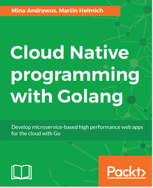

# Aspirants as from 2018-02-06 (Pakt Code)

## gobeys

<ol>

<li><a href="#pktbuild-restful-2017"><b>pkt.build-restful (2017)</b></a>  </li>
<li><a href="#pktcloudnative-2017"><b>pkt.cloudnative (2017)</b></a>  </li>
<li><a href="#pktgo-build-7-apps-2017"><b>pkt.go-build-7-apps (2017)</b></a>  </li>
<li><a href="#pktgo-build-web-app-2016"><b>pkt.go-build-web-app (2016)</b></a>  </li>
<li><a href="#pktgo-designpatterns-2017"><b>pkt.go-designpatterns (2017)</b></a>  </li>
<li><a href="#pktsystems-programming-2017"><b>pkt.systems-programming (2017)</b></a>  </li>
<li><a href="#pktisomorphic-go-2017"><b>pkt.isomorphic-go (2017)</b></a>  </li>
<li><a href="#pktlearning-functional-go-2017"><b>pkt.learning-functional-go (2017)</b></a>  </li>
<li><a href="#pktlearning-go-2016"><b>pkt.learning-go (2016)</b></a>  </li>
<li><a href="#pktmachinelearning-go-2017"><b>pkt.machinelearning-go (2017)</b></a>  </li>
<li><a href="#pktsecurity-go-2018"><b>pkt.security-go (2018)</b></a>  </li>

</ol>

### pkt.build-restful (2017)

  
[⏮️](#gobyes)[⏪](#)[⏩](#pktcloudnative-2017)[⏭️](#eop)  
Title: Building RESTful Web services with Go  
Author(s): Naren Yellavula  
Abstract: Smart Description will be written here ...  
[TOC](toc)  
[HP](https://www.packtpub.com/application-development/building-restful-web-services-go)  
 
  
 

### pkt.cloudnative (2017)

  
[⏮️](#gobyes)[⏪](#pktbuild-restful-2017)[⏩](#pktgo-build-7-apps-2017)[⏭️](#eop)  
Title: Cloud Native programming with Golang  
Author(s): Mina Andrawos, Martin Helmich  
Abstract: Smart Description will be written here ...  
[TOC](toc)  
[HP](https://www.packtpub.com/application-development/cloud-native-programming-golang)  
 
  
 

### pkt.go-build-7-apps (2017)

  
[⏮️](#gobyes)[⏪](#pktcloudnative-2017)[⏩](#pktgo-build-web-app-2016)[⏭️](#eop)  
Title: Go: Building 7 Real-World Projects  
Author(s): Ben Trantor, Rostislav Zsinko, Mat Ryer  
Abstract: Smart Description will be written here ...  
[TOC](toc)  
[HP](https://www.packtpub.com/application-development/go-building-7-real-world-projects)  
 
  
 

### pkt.go-build-web-app (2016)

  
[⏮️](#gobyes)[⏪](#pktgo-build-7-apps-2017)[⏩](#pktgo-designpatterns-2017)[⏭️](#eop)  
Title: Go-Building-Web-Applications  
Author(s): Nathan Kozyra, Mat Ryer  
Abstract: Smart Description will be written here ...  
[TOC](toc)  
[HP](https://www.packtpub.com/application-development/go-building-web-applications)  
 
  
 

### pkt.go-designpatterns (2017)

  
[⏮️](#gobyes)[⏪](#pktgo-build-web-app-2016)[⏩](#pktsystems-programming-2017)[⏭️](#eop)  
Title: Go Design Patterns  
Author(s): Mario Castro Contreras  
Abstract: Smart Description will be written here ...  
[TOC](toc)  
[HP](https://www.packtpub.com/application-development/go-design-patterns)  
 
  
 

### pkt.systems-programming (2017)

  
[⏮️](#gobyes)[⏪](#pktgo-designpatterns-2017)[⏩](#pktisomorphic-go-2017)[⏭️](#eop)  
Title: Go Systems Programming  
Author(s): Mihalis Tsoukalos  
Abstract: Smart Description will be written here ...  
[TOC](toc)  
[HP](https://www.packtpub.com/networking-and-servers/go-systems-programming)  
 
  
 

### pkt.isomorphic-go (2017)

  
[⏮️](#gobyes)[⏪](#pktsystems-programming-2017)[⏩](#pktlearning-functional-go-2017)[⏭️](#eop)  
Title: Isomorphic Go  
Author(s): Kamesh Balasubramanian  
Abstract: Smart Description will be written here ...  
[TOC](toc)  
[HP](https://www.packtpub.com/web-development/isomorphic-go)  
 
  
 

### pkt.learning-functional-go (2017)

  
[⏮️](#gobyes)[⏪](#pktisomorphic-go-2017)[⏩](#pktlearning-go-2016)[⏭️](#eop)  
Title: Learning Functional Programming in Go  
Author(s): Lex Sheehan  
Abstract: Smart Description will be written here ...  
[TOC](toc)  
[HP](https://www.packtpub.com/application-development/learning-functional-programming-go)  
 
  
 

### pkt.learning-go (2016)

  
[⏮️](#gobyes)[⏪](#pktlearning-functional-go-2017)[⏩](#pktmachinelearning-go-2017)[⏭️](#eop)  
Title: Learning Go Programming  
Author(s): Vladimir Vivien  
Abstract: Smart Description will be written here ...  
[TOC](toc)  
[HP](https://www.packtpub.com/application-development/learning-go-programming)  
 
  
 

### pkt.machinelearning-go (2017)

  
[⏮️](#gobyes)[⏪](#pktlearning-go-2016)[⏩](#pktsecurity-go-2018)[⏭️](#eop)  
Title: Machine Learning With Go  
Author(s): Daniel Whitenack  
Abstract: Smart Description will be written here ...  
[TOC](toc)  
[HP](https://www.packtpub.com/big-data-and-business-intelligence/machine-learning-go)  
 
  
 

### pkt.security-go (2018)

  
[⏮️](#gobyes)[⏪](#pktmachinelearning-go-2017)[⏩](#)[⏭️](#eop)  
Title: Security-with-Go  
Author(s): John Daniel Leon  
Abstract: Smart Description will be written here ...  
[TOC](toc)  
[HP](https://www.packtpub.com/networking-and-servers/security-go)  
 
  
 

                
## eop