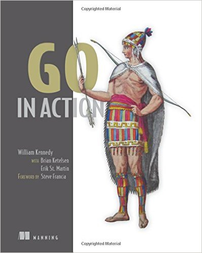
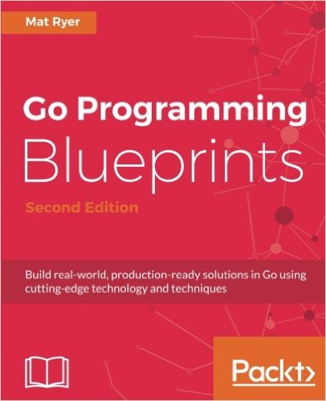
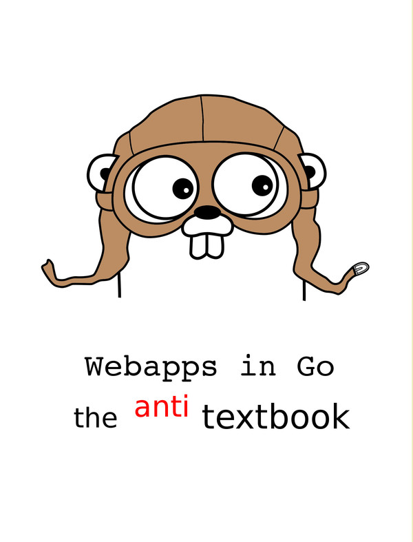

# Some Aspirants (2018-02-03)

## gobyes

<ol>
    <li><a href="#codegangstabwag">⏩</a> <b>codegangsta.bwag</b> </li>
    <li><a href="#goinactioncode-2015">⏩</a> <b>goinaction.code (2015)</b> </li>
    <li><a href="#golangsamanytype">⏩</a> <b>golangsam.anytype</b> </li>
    <li><a href="#jochasingagolang-book">⏩</a> <b>jochasinga.golang-book</b> </li>
    <li><a href="#matryergoblueprints">⏩</a> <b>matryer.goblueprints</b> </li>
    <li><a href="#thewhitetulipweb-dev-golang-anti-textbook">⏩</a> <b>thewhitetulip.anti-textbook</b> </li>
</ol>

### codegangsta.bwag

  
[⏮️](#gobyes)[⏪](#)[⏩](#)[⏭️](#eop)  
Smart description comes here ...  
[Code gobye](corpus/codegangsta.bwag)  
[TOC](tbd)  
[HP](https://codegangsta.gitbooks.io/building-web-apps-with-go/)  
  
   
   

### goinaction.code (2015)

  
[⏮️](#gobyes)[⏪](#)[⏩](#)[⏭️](#eop)  
Great Manning Book written by William Kennedy with Brian Ketelson and Erik St. Martin.  
[Code gobye](corpus/goinaction.code)  
[TOC](tbd)  
[HP](https://www.manning.com/books/go-in-action)  
  
   
   

### golangsam.anytype

  
[⏮️](#gobyes)[⏪](#)[⏩](#)[⏭️](#eop)  
Templates, and ready-to-use go lang source files - generated with dotgo. Here is important not to read the generated stuff, but to understand the mechanic of generation.  
[Code gobye](corpus/golangsam.AnyType)  
[TOC](tbd)  
[HP](https://golangsam.github.io/)  
  
   
   

### jochasinga.golang-book

  
[⏮️](#gobyes)[⏪](#)[⏩](#)[⏭️](#eop)  
The Book was written by Caleb Doxsey with all "inline" go files. Find here an extract of this file into a github repo.
[Code gobye](corpus/jochasinga.golang-book)  
[TOC](tbd)  
[HP](http://www.golang-book.com/)  
  
   
   

### matryer.goblueprints

  
[⏮️](#gobyes)[⏪](#)[⏩](#)[⏭️](#eop)  
Smart description comes here ...
[Code gobye](corpus/matryer.goblueprints)  
[TOC](tbd)  
[HP](https://www.packtpub.com/application-development/go-programming-blueprints-second-edition)  
  
   
   

### thewhitetulip.web-dev-golang-anti-textbook

  
[⏮️](#gobyes)[⏪](#)[⏩](#)[⏭️](#eop)  
Smart description comes here ...
[Code gobye](corpus/thewhitetulip.anti-textbook)  
[TOC](tbd)  
[HP](https://thewhitetulip.gitbooks.io/webapp-with-golang-anti-textbook/content/)  
  
   
   

## eop
